**apis-tester Specification**
=====
**Rev 0.62**

# **目次**
- [**apis-tester Specification**](#apis-tester-specification)
- [**目次**](#目次)
- [**1. 用語・略語**](#1-用語略語)
- [**2. 概要**](#2-概要)
- [**3. ソフトウェア構成**](#3-ソフトウェア構成)
  - [**3.1.  ソフトウェア概要**](#31--ソフトウェア概要)
  - [**3.2. ソフトウェア接続構成**](#32-ソフトウェア接続構成)
- [**4. 機能説明**](#4-機能説明)
- [**4. 設定ファイルについて**](#4-設定ファイルについて)
  - [**4.1. config.py**](#41-configpy)
  - [**4.2. conf/logger.conf**](#42-confloggerconf)
- [**5. Wait Log Keywordについて**](#5-wait-log-keywordについて)
- [**6. Log出力**](#6-log出力)
  - [**6.1. Log 設定**](#61-log-設定)
  - [**6.2. Log出力先**](#62-log出力先)
- [**7. 異常処理**](#7-異常処理)
- [**8. セキュリティ**](#8-セキュリティ)
  - [**8.1. User-APIS Tester間通信セキュリティ**](#81-user-apis-tester間通信セキュリティ)
  - [**8.2. APIS Tester-apis-web間通信セキュリティ**](#82-apis-tester-apis-web間通信セキュリティ)
  - [**8.3. APIS Tester-Device Driver間通信セキュリティ**](#83-apis-tester-device-driver間通信セキュリティ)
- [**9. プライバシー**](#9-プライバシー)
- [**10. OSSライセンス**](#10-ossライセンス)
- [**11. 動作環境**](#11-動作環境)
- [**12. APIS Tester起動方法**](#12-apis-tester起動方法)

 

# **1. 用語・略語**

| **用語**        | **説明**                                                                                                                                                                                                         |
| ------------- | -------------------------------------------------------------------------------------------------------------------------------------------------------------------------------------------------------------- |
| apis-main     | 自律分散制御を可能にするSony CSLが開発した電力相互融通ソフトウェアである。(詳細はapis-main仕様書を参照。)                                                                                                                                                 |
| apis-web      | apis-mainがインストールされた各ノードの固有情報や、ノード間の電力融通に関わる情報をMain Controllerへ提供するソフトウェアである。(詳細はapis-web仕様書を参照。)                                                                                                               |
| Budo Emulator | apis-web内のServiceであり、Main Controllerに対してapis-main間の電力融通情報を提供し、apis-mainの全ノード及び個別ノードに対して電力融通の実行/停止等の設定変更を行うことができる。 “Emulator”という名称は、自律分散制御であるapis-main開発以前の集中管理制御の自動電力融ソフトウェアであるBudoの情報提供を模倣する機能であることから付けられている。 |
| API Server    | apis-web内のServiceであり、クラスタ内に電力融通の実行命令を意図的に生成したり、任意のError処理命令をクラスタ内に生成したりすることができる。                                                                                                                               |
| Grid Master   | apis-mainに含まれるServiceの名称でDC Gridを制御し電力融通を実現する。                                                                                                                                                                 |

 

# **2. 概要**

APIS TesterはAPISを評価するためのテストツールであり、電力融通評価や、Error処理評価等をスケジューリングし自動で実行し、評価結果をLogとして収集可能である。図2-1に示すようにAPIS TesterはEthernet等のコミュニケーションラインに接続されたapis-webやDC/DC ConverterのDevice Driverが提供するWeb APIを利用することでAPIS評価に必要な操作を実施する。

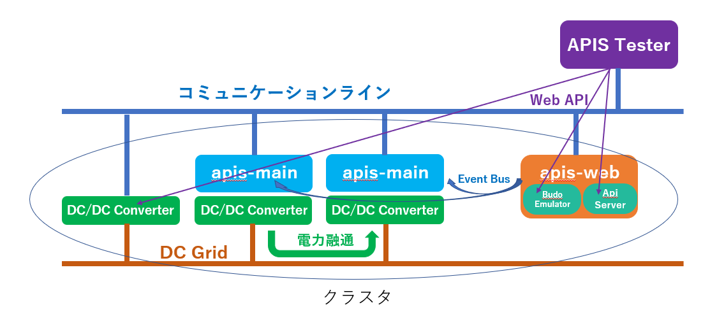  
Figure 2-1  

 

# **3. ソフトウェア構成**

## **3.1.  ソフトウェア概要**

APIS Testerのソフトウェア構成としては以下の図3-1で示すように大まかに表示部と制御部に分けることができる。表示部に関しては標準的な構成ではあるが、TPLテンプレートでWebコンテンツの構造を作成し、CSSにて飾り付けを行ってJavaScriptで画面に動きを持たせている。制御部に関してはWebアプリケーション作成用フレームワークであるPython Bottleを採用し、Runnerはスケジューリングされた評価の順番に従ってSet Apis Operation Deal、Generate Deal、Generate Error、Control DCDC、Wait Log、Waitの 6種類のスレッドを起動する。(Wait Logスレッドのみが並列実行され、その他は逐次実行される。)

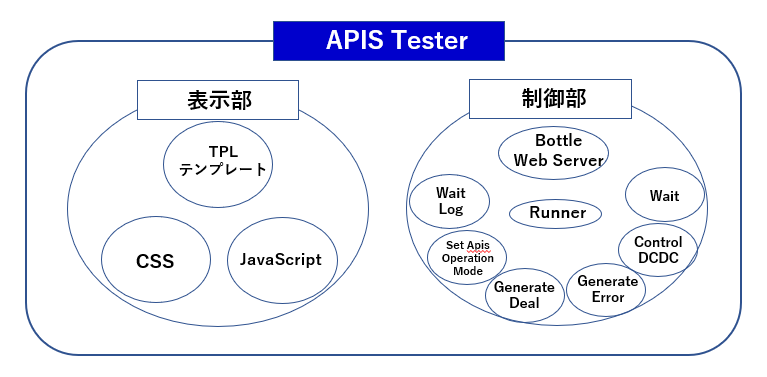  
Figure 3-1

## **3.2. ソフトウェア接続構成**

APIS Testerのソフトウェア接続構成を以下の図3-2に示す。Userがブラウザ上でAPIS Testerに対してWeb APIを発行すると制御部のBottle Web Serverがそのリクエストを受け取り、表示部のTPLテンプレート、CSS、JavaScriptがUser側のブラウザにダウンロードされて画面を表示する。Userは表示されたブラウザ上でAPIS評価に必要な操作を登録し、実行する。Userから実行命令を受け取ったBottle Web ServerはRunnerを起動し登録された操作の順番にSet Apis Operation Mode等のスレッドを起動する。起動したスレッドはそれぞれの機能に応じてapis-webやDC/DCD Converterが提供するWeb APIを実行する。

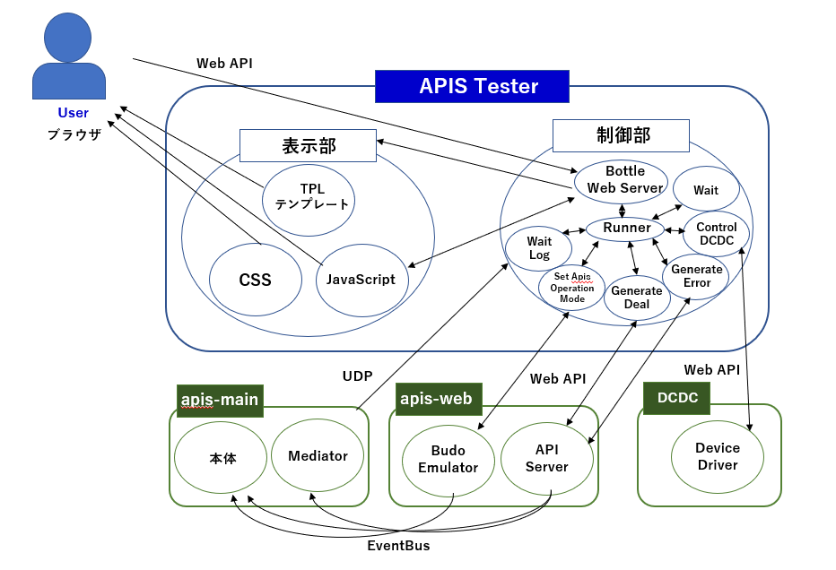  
Figure 3-2  

 

# **4. 機能説明**

図4-1にAPIS Testerの起動画面を示す。 APIS Tester起動時はプルダウンメニューと数個のボタンで構成される非常にシンプルな画面となっている。プルダウンメニューからSet APIS Operation ModeやGenerate Dealなどの操作を選択し、\[Add\]ボタンを押下することで選択された操作をAPIS Tester上のSequence画面に追加することができる。Sequence画面に追加された操作は選択した順に番号が振られ\[Start\]ボタンを押下すると若い番号順に連続して操作を実行することができる。

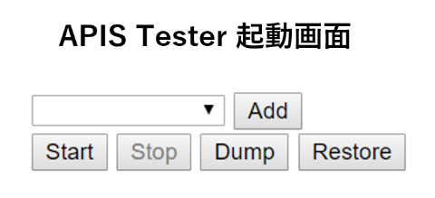  
図4-1  

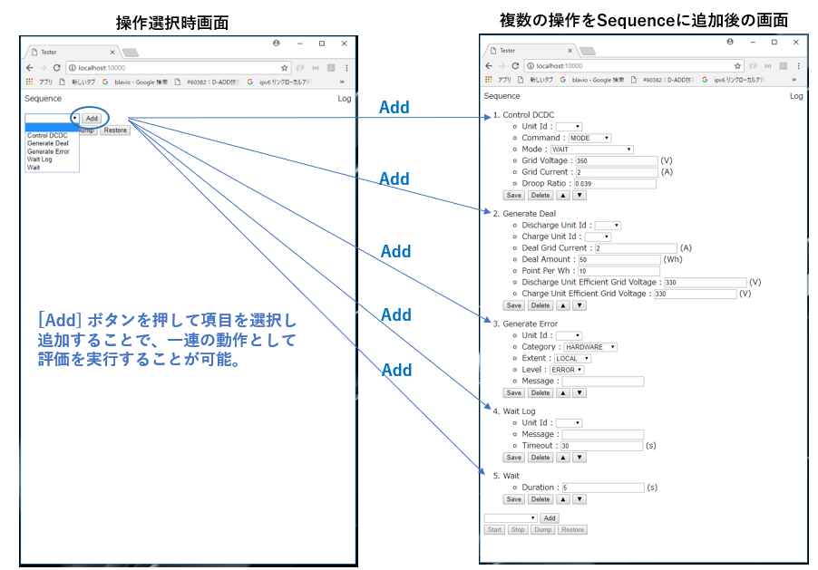  
図4-2  

1. Set APIS Operation Mode  
 * APISはクラスタ内の電力融通に関するModeをもっており、Set APIS Operation ModeはそのModeを変更するための操作である。クラスタ全体に関わるModeをGlobal Operation Mode 、各ノードのみに関わるModeをLocal Operation Modeと呼び、以下ように４種類の設定が可能である。(Local Operation Modeに関しては Soft StopとForce Stopのみ設定可能である。)  
    * Run : 電力融通生成を有効にする電力融通稼働時の標準Settingである。  
    * Soft Stop : 既存の電力融通は実施するが、新たな電力融通生成は行わない。  
    * Force Stop : 既存の電力融通を停止させ、新たな電力融通生成も行わない。  
    * Manual : 検査等でDC/DC Converter等をManualで動作させるためのModeである。

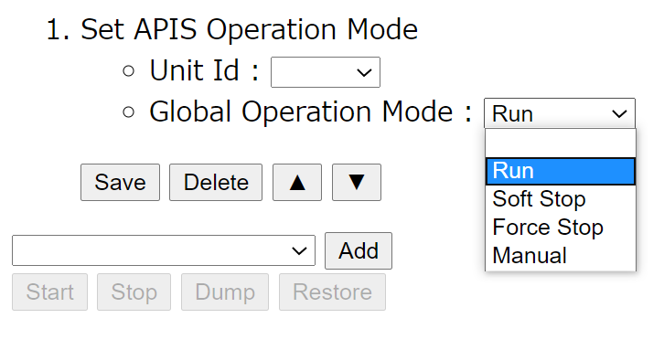  
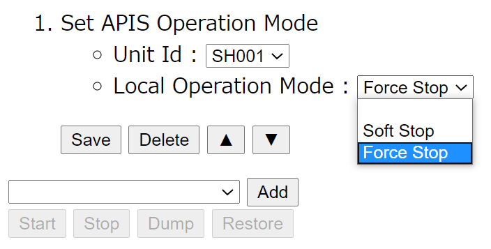

図4-1のAPIS TesterのプルダウンメニューでSet APIS Operation Modeを選択し、\[Add\]ボタンを押下すると図4-3の画面が追加される。  
Unit IdとOperation Modeについてそれぞれの横に配置されているプルダウンメニューから設定したい項目を選択する。(プルダウンメニューに現われるUnit Idはconfig.pyにて設定する。config.pyは4.1 config.py参照。)  
Unit Idを空白に設定するとGlobal Operation Modeが設定でき、任意のUnit Idを指定するとそのノードのみに影響するLocal Operation Modeを設定することができる。  
\[Save\]ボタンを押下するとグレーアウトされていた\[Start\]、\[Dump\]、\[Restore\]ボタンが押下可能になり操作を実行することが可能になる。  
操作を実行するとapis-webのBudo Emulatorに対してWeb APIを発行する。(apis-webやBudo Emulatorについてapis-web仕様書を参照すること。)

 

2.  Generate Deal  
  * Generate Dealは電力融通の実行命令を意図的にクラスタ内に生成するための操作である。図4-1のAPIS TesterのプルダウンメニューでGenerate Dealを選択し、\[Add\]ボタンを押下すると図4-5の画面が追加される。Generate Dealの操作をSaveする前に以下の項目を入力する必要がある。
    * Discharge Unit Id : 放電側のノードをUnit Idで指定する。
    * Charge Unit Id : 充電側のノードをUnit Idで指定する。
    * Deal Grid Current : 電力融通時の電流値\[A\]を指定する。
    * Deal Amount : 電力融通時の電力量\[Wh\]を指定する。
    * Point Per Wh : 電力融通時の1Wh当たりのポイントを指定する。
    * Discharge Unit Efficient Grid Voltage : 放電側のノードのDC/DC Converterの効率を考慮したDC Grid側の電圧を指定する。
    * Charge Unit Efficient Grid Voltage : 放電側のノードのDC/DC Converterの効率を考慮したDC Grid側の電圧を指定する。  
       
         

       Discharge Unit Id, Charge Unit Id以外に関してはconfig.pyにDefault値を設定することで\[Add\]ボタン押下後、設定したDefault値を反映した状態で画面を追加することが可能である。Discharge Unit Id, Charge Unit Idのプルダウンメニューで現れるUnit Idはconfig.pyの設定が反映される。(config.pyは4.1 config.py参照。)

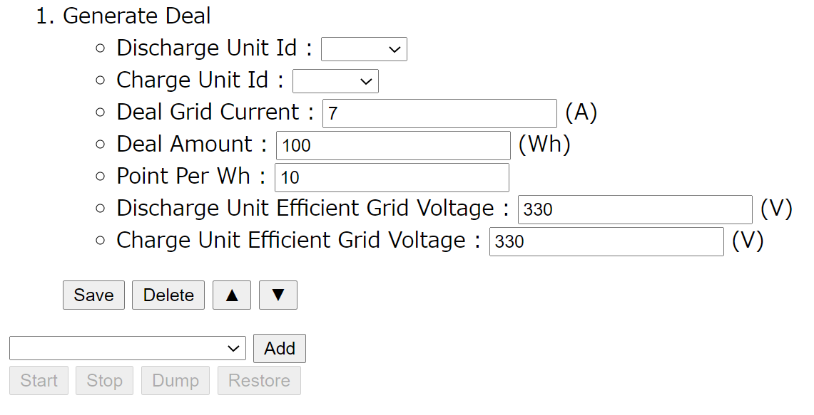  
図4-5

項目を適切に設定し\[Save\]ボタンを押下するとグレーアウトされていた\[Start\]、\[Dump\]、\[Restore\]ボタンが押下可能になる。操作を実行するとapis-webのAPI Serverが提供するWeb APIを実行する。(apis-webやAPI Serverについてapis-web仕様書を参照すること。)

3.  Generate Error
  * Generate Errorは任意のError処理命令をクラスタ内に生成するための操作である。図4-1のAPIS TesterのプルダウンメニューでGenerate Errorを選択し、\[Add\]ボタンを押下すると図4-6の画面が追加される。Generate Errorの操作をSaveする前に以下の項目を入力する必要がある。
    * Unit Id : Errorが発生したノードをUnit Idで指定する。
    * Category : Error Categoryを以下から指定する。(詳細はapis-main仕様書参照。)
    * HARDWARE、FRAMEWORK、LOGIC、 USER
    * Extent : Error の影響範囲を以下から指定する。(詳細はapis-main仕様書参照。)
    * GLOBAL, LOCAL Level : ErrorのLevelを以下から指定する。(詳細はapis-main仕様書参照。)
    * FATAL、ERROR、WARN Message : Logに残すためのMessageを入力する。(未入力可。)  
       
         
         Unit Id, Message以外に関してはconfig.pyにDefault値を設定することで\[Add\]ボタン押下後、設定したDefault値を反映した状態で画面を追加することが可能である。Unit Idのプルダウンメニューで現れるUnit Idはconfig.pyの設定が反映される。(config.pyは4.1 config.py参照。)

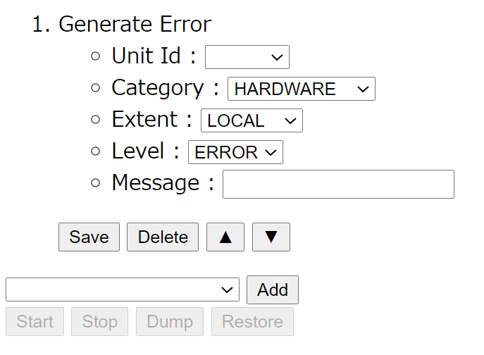  
図4-6

項目を適切に設定し\[Save\]ボタンを押下するとグレーアウトされていた\[Start\]、\[Dump\]、\[Restore\]ボタンが押下可能になる。操作を実行するとapis-webのAPI Serverが提供するWeb APIを実行する。(apis-webやAPI Serverについてapis-web仕様書を参照すること。)

4.  Control DCDC
* Control DCDCはクラスタ内のDC/DC Converterを制御するための操作である。  
 > **\[注意点\] DC/DC ConverterのDevice Driverへの指示が衝突するため、この操作を**  
 > **行う際には必ず操作を行うノードのapis-mainをManual Modeに入れるか、Shutdownさせること。**  

   * 図4-1のAPIS TesterのプルダウンメニューでControl DCDCを選択し、\[Add\]ボタンを押下すると図4-7の画面が追加される。Control DCDCの操作をSaveする前に以下の項目を入力する必要があるが、Commandの選択によってさらに図4-8～図4-12のように設定画面が切り替わる。
     * Unit Id : Control するDC/DC ConverterのノードをUnit Idにて指定する。
     * Command : DC/DC ConverterのCommandを指定する。
     * MODE、VOLTAGE、CURRENT

  
図4-7

  

(1)  CommandでMODEを選択した場合  
&emsp;DC/DC Converterの動作Modeを変更するための操作で、図4-8の画面に切り替わり以下の項目を追加で設定する。

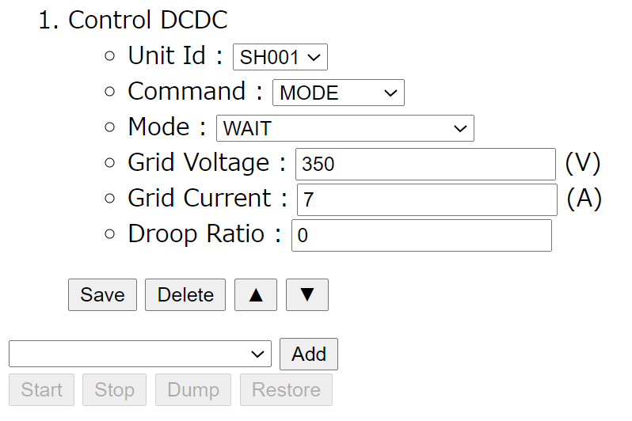  
図4-8

(1-1)Mode  
&emsp;DC/DC Converterに設定するModeを入力する。

(1-1-1)VOLTAGE REFERENCE  
&emsp;Constant Voltage Mode(CV Mode)に設定する。  
&emsp;DC Gridの目標電圧をGrid Voltageに設定する。  
&emsp;DC Gridへの電流出力制限をGrid Currentに設定する。  
&emsp;Droop制御をDroop Ratioに設定する。

(1-1-2)CHARGE  
&emsp;Constant Current Mode(CC Mode)に設定する。
&emsp;DC Gridからの充電電流をGrid Currentに設定する。

(1-1-3)DISCHARGE  
&emsp;Constant Current Mode(CC Mode)に設定する。  
&emsp;DC Gridからの放電電流をGrid Currentに設定する。

(1-1-4)WAIT  
Wait Modeに設定する。  
  
(1-2)Grid Voltage  
&emsp;Mode設定でVOLTAGE REFERENCEが選択された場合はDC Gridの目標電圧をこの値に設定する。
  
(1-3)Grid Current  
&emsp;Mode設定でVOLTAGE REFERENCEが選択された場合はDC Gridへの電流出力をこの値に制限する。  
&emsp;Mode設定でCHARGEもしくはDISCHARGEが選択された場合はそれぞれDC Gridに対して充放電する電流値をこの値に設定する。
  
(1-4)Droop Ratio  
&emsp;Mode設定でVOLTAGE REFERENCEが選択された場合はDroop制御をこの値で制御する。  

  

(2)  CommandでVOLTAGEを選択した場合  
&emsp;図4-9の画面に切り替わり以下の項目を追加で設定する。  
&emsp;この操作は指定したUnit IdのノードのDC/DC ConverterのModeがVOLTAGE REFERENCEで動作している際にDC Grid側の目標電圧を変更する。
  
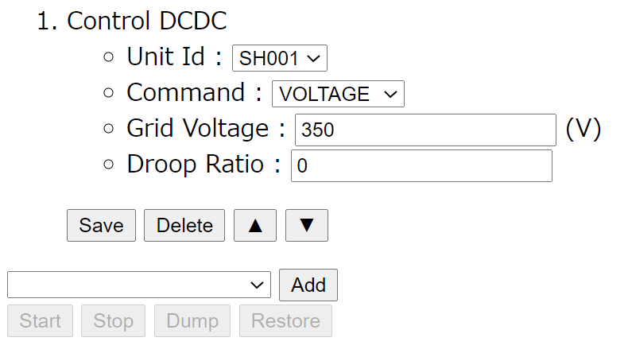  
図4-9
  
(2-1)Grid Voltage  
&emsp;DC Gridの目標電圧を設定値に変更する。  
  
(2-2)Droop Ratio  
&emsp;Droop制御を設定値に変更する。

  

(3)  CommandでCURRENTを選択した場合  
図4-10の画面に切り替わり以下の項目を追加で設定する。  
この操作は指定したUnit IdのノードのDC/DC ConverterのModeがCHARGE 、DISCHARGEやVOLTAGE\_REFERENCEで動作している際にDC Grid側の電流値を変更する。
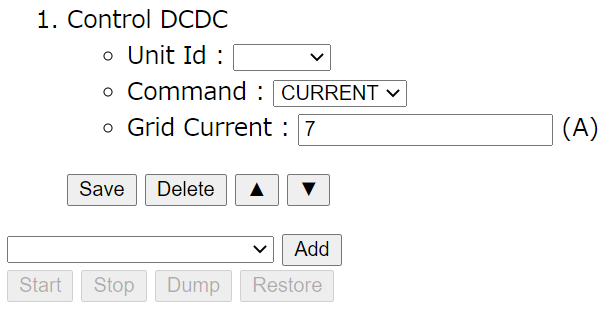  
図4-10  
  
(3-1)Grid Current  
&emsp;DC Gridの電流を設定値に変更する。  
&emsp;項目を適切に設定し\[Save\]ボタンを押下するとグレーアウトされていた\[Start\]、\[Dump\]、\[Restore\]ボタンが押下可能になる。操作を実行すると指定されたUnit IdのノードのDC/DC ConverterのDevice Driverが提供するWeb APIを実行する。

 

5.  Wait Log
   * Wait Logはapis-mainがコミュニケーションライン上にUDP出力するLogから指定されたKeywordが検出されるまでスケジューリングされている次の操作に移らずWaitを行う操作である。UDP出力されるLogの中にはapis-mainの動作Log等が含まれるため、ある動作を待って別の操作を行いたい場合など次の操作のタイミングを合わせるために使用する。図4-1のAPIS TesterのプルダウンメニューでWait Logを選択し、\[Add\]ボタンを押下すると図4-11の画面が追加される。Wait Logの操作をSaveしてスケジューリングのSequenceに追加する前に以下の項目を入力する必要がある。
     * Unit Id : Keywordを監視するノードをUnit Idで指定する。
     * Unit Idを指定しない場合は全のノードが対象となる。
     * Message : 監視するKeywordを指定する。正規表現にも対応する。(Keywordの例を後述する。)
     * Timeout : Timeoutを指定する。

  
図4-11
項目を適切に設定し\[Save\]ボタンを押下するとグレーアウトされていた\[Start\]、\[Dump\]、\[Restore\]ボタンが押下可能になる。

 

6.  Wait  
  * Wait Logはスケジューリングされている次の操作に移る前に指定された時間Waitを行う操作である。図4-1のAPIS TesterのプルダウンメニューでWaitを選択し、\[Add\]ボタンを押下すると図4-12の画面が追加される。Waitの操作をSaveしてスケジューリングのSequenceに追加する前に以下の項目を入力する必要がある。
    * Duration : Waitする時間を秒で指定する。

図4-12  
項目を適切に設定し\[Save\]ボタンを押下するとグレーアウトされていた\[Start\]、\[Dump\]、\[Restore\]ボタンが押下可能になる。

 

\[その他の操作\]  
操作\[Save\]後の各ボタンの変化を図4-13に示す。  
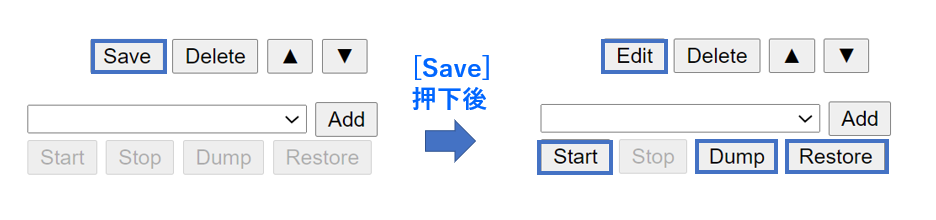  
図4-13  

* \[Save\]ボタン : 編集内容を確定する。
* \[Edit\]ボタン : 再度項目を修正する。
* \[Delete\]ボタン : Sequenceに追加した操作を削除する。
* \[▲\]\[▼\]ボタン : Sequenceに追加した操作の順番を変える。
* \[Start\]ボタン : \[Save\]された操作を順番に実行する。
* \[Stop\]ボタン : 実行が開始された操作のSequenceを途中で止める。
* \[Dump\]ボタン : 操作や、入力された設定値をJSON形式のテキストファイルに出力する。
* \[Restore\]ボタン : 出力したJSON形式のテキストファイルを読み込み、元のSequenceを再度構築する。

   

\[APIS Tester Operation Log出力\]

図4-14のように操作の実行に関するLogはAPIS Testerのブラウザ上に表示される。  
このLogは\[Erase\]ボタンで消去可能である。  
  
図4-14  

 

# **4. 設定ファイルについて**
    
## **4.1. config.py**

APIS Testerの設定項目を以下に示す。

|||
| -------------------------------------- | ------------------------------------------------------------------------------------------------------------------------------------------------------------------ |
| my\_host                               | Bottle Web Server用IP|
| my\_port                               | Bottle Web Server用Port番号                                                                                  |
| is\_emulation                          | 実際のDC/DC ConverterやBatteryを使うのではなくハードウェアエミュレータを使用するか否か True, Falseで設定する。                                  |
| emulator\_host                         | ハードウェアエミュレータ用IP Address                                                                                   |
| emulator\_port                         | ハードウェアエミュレータ用Port番号                                                                                       |
| apis\_web\_host                        | apis-web用IP Address                                                                                       |
| apis-web\_budo\_emulator\_port         | apis-webのbudo\_emulator用Port番号                                                                            |
| apis-web\_api\_server\_port            | apis-webのapi\_server用Port番号                                                                               |
| apis\_log\_group\_address              | IP Addressの特定のグループを指定するマルチキャストアドレス、apis-logのconfig.json内のlog.Receiver.multicatGroupAddressと合わせる。          |
| apis\_log\_port                        | apis-logのLog Receiver用Port番号                                                                              |
| units.id                               | APIS Testerによって評価するノードのUnit Idを設定する。Unit Idのプルダウンメニューから選択可能になる。                                           |
| units.name                             | APIS Testerによって評価するノードのUnit Idを設定する。Log等の表示で使用される。                                                        |
| units.host                             | APIS Testerによって評価するノード用IP Address                                                                         |
| units.dcdc\_port                       | APIS Testerによって評価するノードのDC/DC Converter情報を取得するDevice Driver用Port番号                                         |
| units.emu\_port                        | APIS Testerによって評価するノードのBattery情報を取得するDevice Driver用Port番号                                                 |
| default\_control\_dcdc\_command        | Control DCDC操作のCommand欄にDefaultで表示される設定                                                                   |
| default\_control\_dcdc\_mode           | Control DCDC操作のMode欄にDefaultで表示される設定                                                                      |
| default\_grid\_voltage\_v              | Control DCDC操作のGrid Voltage欄にDefaultで表示される設定                                                              |
| default\_grid\_current\_a              | Control DCDC操作のGrid Current欄にDefaultで表示される設定                                                              |
| default\_droop\_ratio                  | Control DCDC操作のDroop Ratio欄にDefaultで表示される設定                                                               |
| default\_deal \_grid\_current\_a       | Generate Deal操作のDeal Grid Current欄にDefaultで表示される設定                                                        |
| default\_deal\_amount\_wh              | Generate Deal操作のDeal Amount欄にDefaultで表示される設定                                                              |
| default\_point\_per\_wh                | Generate Deal操作のPoint Per Wh欄にDefaultで表示される設定                                                             |
| default\_efficient\_grid\_voltage\_v   | Generate Deal操作のDischarge Unit Efficient Grid VoltageとCharge Unit Efficient Grid Voltage欄にDefaultで表示される設定 |
| default\_error\_level                  | Generate Error操作のLevel欄にDefaultで表示される設定                                                                   |
| default\_error\_extent                 | Generate Error操作のExtent欄にDefaultで表示される設定                                                                  |
| default\_error\_category               | Generate Error操作のCategory欄にDefaultで表示される設定                                                                |
| default\_wait\_log\_timeout\_s         | Wait Log操作のTimeout欄にDefaultで表示される設定                                                                       |
| default\_wait\_duration\_s             | Wait操作のDuration欄にDefaultで表示される設定                                                                          |
| default\_apis\_global\_operation\_mode | Set Apis Operation Mode操作のGlobal Operation Mode欄にDefaultで表示される設定                                          |
| default\_apis\_local\_operation\_mode  | Set Apis Operation Mode操作のLocal Operation Mode欄にDefaultで表示される設定                                           |

 

## **4.2. conf/logger.conf**

APIS TesterはLoggerを初期化する関数としてlogging.config.fileConfig()を採用している。この関数は予め設定が記載されたlogger.confを起動時に読み込むことでLoggerを初期化する。

<table>
<tbody>
<tr class="even">
<td>loggers</td>
<td>keys : Loggerインスタンス名記述</td>
</tr>
<tr class="odd">
<td>handlers</td>
<td>keys : Handlerインスタンス名記述</td>
</tr>
<tr class="even">
<td>formatters</td>
<td>keys : Formatterインスタンス名記述</td>
</tr>
<tr class="odd">
<td>logger_root</td>
<td>
level : メッセージ出力レベル指定

handlers : 適用handlerインスタンス名指定
</td>
</tr>
<tr class="even">
<td>
handler_consoleHandler

handler_infoFileHandler
</td>
<td>
class: 実装Handlerクラス指定　

-StreamHandler: 指定ストリーム出力

-FileHandler: 指定ファイル出力

level: 指定レベル以上のメッセージを出力

formatter: 出力時メッセージ成型使用のFormatter名指定

args: Handlerクラスインスタンス化使用引数

　　 Log出力先やLogファイル保存フォルダ設定
</td>
</tr>
<tr class="odd">
<td>
formatter_consoleFormatter

formatter_infoFileFormatter
</td>
<td>
format :　各種Format指定

datefmt : 日付Format指定
</td>
</tr>
</tbody>
</table>

 

# **5. Wait Log Keywordについて**

Wait Logで監視する際に使用するKeyword例を参考として以下に示す。

<table>
<tbody>
<tr class="odd">
<td> Grid Master Unit Id確認</td>
<td>gridMasterUnitId</td>
</tr>
<tr class="even">
<td>Deal情報</td>
<td>deals</td>
<tr class="odd">
<td>Grid Master Deal処理開始</td>
<td>AbstractDealExecution</td>
</tr>
<tr class="even">
<td>Deal ID</td>
<td>dealIds</td>
<tr class="odd">
<td>DC Grid電圧立ち上げ</td>
<td>VOLTAGE\_REFERENCE.execute()</td>
</tr>
<tr class="even">
<td>DC Grid電圧Rampup終了</td>
<td>ramped up</td>
<tr class="odd">
<td>電圧Reference権限の獲得開始</td>
<td>VoltageReferenceAuthorization.execute()</td>
</tr>
<tr class="even">
<td>電圧Reference権限の獲得成功</td>
<td>VoltageReferenceAuthorization.execute(); res.succeeded()</td>
<tr class="odd">
<td></td>
<td>電流Compensation開始</td>
</tr>
<tr class="even">
<td>Discharge開始</td>
<td>DcdcControllingCommand\] DISCHARGE.execute()</td>
<tr class="odd">
<td>電流Compensation成功</td>
<td>compensated</td>
</tr>
<tr class="even">
<td>電力融通積算開始</td>
<td>mediator.util.DealUtil\] deal started</td>
<tr class="odd">
<td>電力融通積算中</td>
<td>mediator.util.DealUtil\] deal cumulated</td>
</tr>
<tr class="even">
<td>電力融通積算ストップ</td>
<td>mediator.util.DealUtil\] deal stopped</td>
</tbody>
</table>

 

# **6. Log出力**
    
## **6.1. Log 設定**

Log出力にはPython標準ライブラリモジュールの”logging”を使用している。設定はconf/logger.confファイルに記載することでLogの出力先やLogファイルの保存先、出力もしくは保存するLog Level等の設定を行っている。

 

## **6.2. Log出力先**

APIS Testerの操作の実行に関するLogはAPIS Testerのブラウザ上に表示され、ブラウザで動作するJavaScriptがBottle Web Serverが提供するWeb APIを実行する際のLogはConsole出力とファイル出力の2つの出力先がある。

 

# **7. 異常処理**

不具合が発生するとConsoleとファイルにLogは出力するが、自らをリセットしたり、停止させたりする機能はない。

 

# **8. セキュリティ**
    
## **8.1. User-APIS Tester間通信セキュリティ**

User – APIS Tester間通信にはセキュリティは施されていないため必要に応じてBottle Web Server設定上でIP Addressアクセス制限等を実施する。

 

## **8.2. APIS Tester-apis-web間通信セキュリティ**

APIS Tester - apis-web間通信にはセキュリティは施されていないため必要に応じてapis-webのWeb Serverの設定上でIP Addressアクセス制限等を実施する。

 

## **8.3. APIS Tester-Device Driver間通信セキュリティ**

APIS Tester- Device Drier間通信にはセキュリティは施されていないため必要に応じてDevice DriverのWeb Serverの設定上でIP Addressアクセス制限等を実施する。

 

# **9. プライバシー**

Web APIによって取得できる情報が、個人情報に該当するかはAPIS Testerの導入地域によって異なるため確認が必要である。また、個人情報に該当する場合で、持ち主の許可なく外部のサーバに送信する行為はGDPR等の個人情報保護規制の対象になる可能性があるため注意が必要である。

 

# **10. OSSライセンス**

以下にAPIS Testerが使用するソフトウェアとそのOSSライセンスの情報を記載する。

■APIS Testerで使用されるソフトウェアとそのOSSライセンス情報

| ソフトウェア  | バージョン   | ライセンス             | コード改変 |
| ------- | ------- | ----------------- | ----- |
| Python  | 3.7.5   | PSL License       | 無     |
| tornado | 6.0.3   | Apache License2.0 | 無     |
| Bottle  | 0.12.17 | MIT License       | 無     |
| pytz    | 2019.3  | MIT License       | 無     |
| six     | 1.13.0  | MIT License       | 無     |
| jQuery  | 3.3.1   | MIT License       | 無     |

※諸事情によりソフトウェアバージョンは変更される可能性があります。

 

# **11. 動作環境**

以下に確認した動作確認環境を示す。

<table>
<tbody>
<tr class="odd">
<td rowspan="3">MacBook Pro</td>
<td>CPU</td>
<td>Intel Core i5 Dual Core 3.1GHz</td>
</tr>
<tr class="even">
<td>System Memory</td>
<td>8GB</td>
</tr>
<tr class="odd">
<td>OS</td>
<td>Mac OS X 10.13.6</td>
</tr>
</tbody>
</table>

 

# **12. APIS Tester起動方法**

以下にAPIS Tester起動方法を示す。

1.  Console上で ./startTester.pyを実行する。
2.  Webブラウザ上でconfig.pyのmy\_host, my\_portで指定したIP AddressとPort番号にlアクセスする。(例: localhost:10000/)
